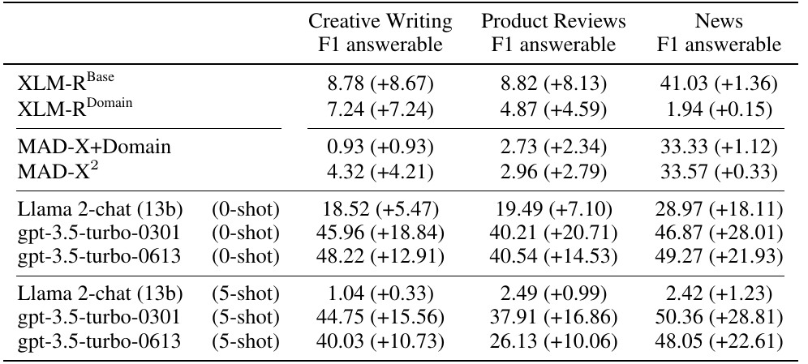

# SQuAD v2 - Multilingual Evaluation
The SQuAD2.0 metric [(Rajpurkar et al., 2018)](https://aclanthology.org/P18-2124/) is the state-of-the-art metric to evaluate extractive question answering. To compute the F1 and EM (exact match) scores, it utilizes _whitespace tokenization_, which works well for languages that rely on whitespaces to separate words but does not work for languages that do not require whitespaces, such as Chinese or Thai. Nevertheless, the default SQuAD metric has been used to evaluate multilingual extractive question answering, most prominently in the XQuAD [(Artetxe et al., 2020)](https://aclanthology.org/2020.acl-main.421/) benchmark.

To better evaluate languages that do not rely on whitespaces, we propose to use a word tokenizer instead.


## Problem
The original SQuAD 2.0 evaluation metric uses the following tokenization function:
```python
def get_tokens(s):
    if not s:
        return []
    return normalize_answer(s).split()
```

This whitespace tokenization only produces the desired results for languages that use whitespace to separate words. XQuAD, for example, also contains examples in Chinese and Thai, which don't rely on whitespaces and may be used only to separate sentences or to emphasize words.

## Solution
We propose using a word tokenizer for languages that do not rely on whitespaces. Our `get_tokens` function looks like this:

```python
def get_tokens(s, language, use_word_tokenizer):
    if not s:
        return []
    if use_word_tokenizer:
        if language == "chinese":
            return list(jieba.cut(normalize_answer(s)))
        else:
            return tokenize.word_tokenize(normalize_answer(s), language=language)
    else:
        return normalize_answer(s).split()
```

### Hugging Face Evaluate 
To be able to use our metric with the widely-used Hugging Face evaluate library, you can use the `M2QAMetric` class from [m2qa_metric.py](m2qa_metric.py):
```python
from M2QA_Metric.m2qa_metric import M2QAMetric

# 1. Load our adapted multilingual SQuAD 2.0 metric
m2qa_metric = M2QAMetric()

#2. call the metric you would normally do, but add the "language" parameter
full_results = m2qa_metric.compute(
    predictions=predictions,
    references=references,
    no_answer_threshold=0.95,
    language=language,
)
```

This metric also works with the Hugging Face evaluator pipeline for extractive question answering:
```python
from M2QA_Metric.m2qa_metric import M2QAMetric
import evaluate

# 1. Initialize your QA evaluator (this is unchanged)
qa_evaluator = evaluate.evaluator("question-answering")

# 2. Load our adapted multilingual SQuAD 2.0 metric
metric = M2QAMetric()

# 3. Before computing the results, you have to set the language that the data is in
qa_evaluator.METRIC_KWARGS["language"] = language

# 4. Then call the evaluator as always (this is unchanged)
results = qa_evaluator.compute(
    tokenizer=tokenizer,
    model_or_pipeline=model,
    data=squad_v2_dataset["validation"],
    metric=metric,
    squad_v2_format=True,
)
```


### Adapted Version of the Official SQuAD v2.0 Evaluation Script
We provide an adapted version of the official SQuAD v2.0 [evaluation script](https://rajpurkar.github.io/SQuAD-explorer/) here: [m2qa_metric_official_squad_v2_eval_script.py](m2qa_metric_official_squad_v2_eval_script.py)


## Results
Chinese results using the adapted SQuAD 2.0 metric with word tokenization instead of whitespace tokenization, affecting F1 scores on answerable questions. Relative changes to Table 2 are shown in parentheses:

