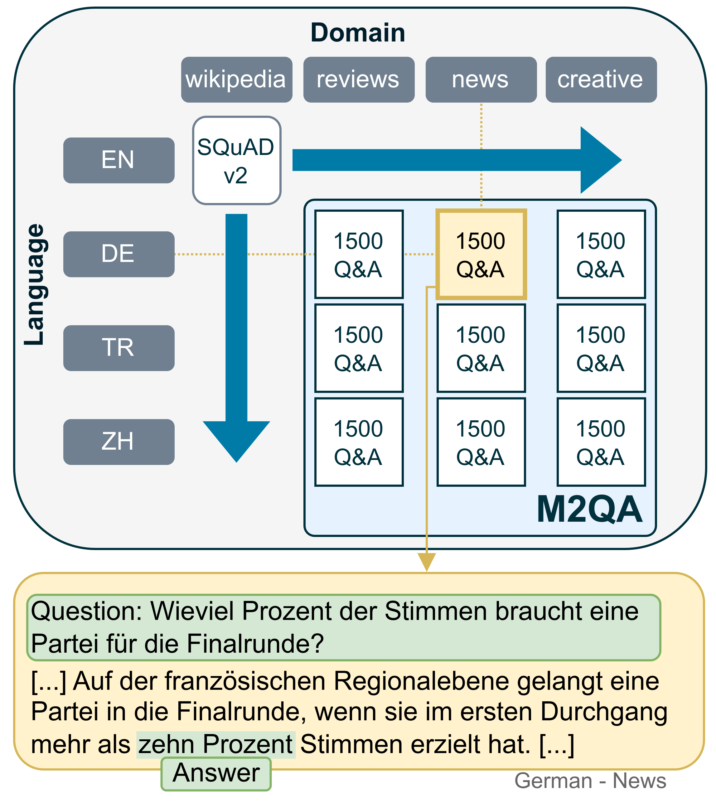

# M2QA: A Multi-domain Multilingual Question Answering Benchmark Dataset
> 🎉 M2QA has been accepted to EMNLP Finding 2024 🎉

M2QA (Multi-domain Multilingual Question Answering) is an extractive question answering benchmark for evaluating joint language and domain transfer. M2QA includes 13,500 SQuAD 2.0-style question-answer instances in German, Turkish, and Chinese for the domains of product reviews, news, and creative writing.

This repository accompanies our paper "[M2QA: Multi-domain Multilingual Question Answering](https://aclanthology.org/2024.findings-emnlp.365/)" and provides access to the benchmark dataset, our custom-built annotation platform, and the code to reproduce all our experiments.

<p align="center">

</p>

## Data
The M2QA benchmark dataset consists of 13,500 SQuAD 2.0-style question-answer instances, divided evenly across nine language-domain combination pairs (1500 instances each). 40% of the data are unanswerable questions, 60% are answerable.

The data is provided in [m2qa_dataset/](m2qa_dataset) and uploaded on Hugging Face: [https://huggingface.co/datasets/UKPLab/m2qa](https://huggingface.co/datasets/UKPLab/m2qa)

Following [Jacovi et al. (2023)](https://aclanthology.org/2023.emnlp-main.308/), we encrypt the data to prevent leakage of the dataset into LLM training datasets. Have a look at [m2qa_dataset/README.md](m2qa_dataset/README.md) to see how easily you can use the dataset.

### Additional Training Data
We also provide additional training data for five domain-language pairs, consisting of 1500 question-answer instances each, totalling 7500 training examples. This data is available in the [m2qa_dataset/Additional_Training_data](m2qa_dataset/Additional_Training_data) directory.


## Experiments & Results
Our main contributions include:
1. **Baselines:** We evaluate baseline and transfer performance on M2QA using a wide range of models and transfer techniques, including fully-finetuned models, modular transfer learning and LLMs.
2. **Domain and language are not independent axes:** We find that transfer performance considerably varies across domain-language combinations.
3. **SQuAD 2.0 metric not applicable in every language:** We find that the widely used SQuAD 2.0 evaluation metric is insufficient for evaluating multilingual extractive QA due to its reliance upon whitespace tokenization and propose a version of the metric that mitigates the issue. For more information, have a look at Section 5.1 of our paper or [Experiments/M2QA_Metric/README.md](Experiments/M2QA_Metric/README.md).
4. **More research has to be done on joint language and domain transfer!** Our results show that modern LLMs perform considerably worse on their target than on their source domain-language pair, highlighting the need for further research into methods that transfer both linguistic *and* domain-specific information.

We provide the code to reproduce all our experiments in the [Experiments/](Experiments) directory. Have a look at  [Experiments/README.md](Experiments/README.md) for a detailed explanation of our experiments and how to reproduce them. There, you find everything, including the code to reproduce these main results:


### XLM-RoBERTa Increased Chinese Performance
The M2QA data in Chinese "Creative Writing" and "Product Reviews" do not contain whitespaces. This leads to reduced performance of XLM-RoBERTa. We find that the performance of XLM-RoBERTa can be drastically increased by simply adding whitespaces between every word:


## Annotation Platform
We have developed a new annotation platform to fulfil all of our requirements. The source code can be found in the [Website/](Website) directory. In the [Website/README.md](Website/README.md), you can find screenshots of the website and instructions on how to set it up.


## Citation
If you use M2QA in your work, please consider citing our paper:
```
@inproceedings{englander-etal-2024-m2qa,
    title = "M2QA: Multi-domain Multilingual Question Answering",
    author = {Engl{\"a}nder, Leon  and
      Sterz, Hannah  and
      Poth, Clifton A  and
      Pfeiffer, Jonas  and
      Kuznetsov, Ilia  and
      Gurevych, Iryna},
    booktitle = "Findings of the Association for Computational Linguistics: EMNLP 2024",
    month = nov,
    year = "2024",
    address = "Miami, Florida, USA",
    publisher = "Association for Computational Linguistics",
    url = "https://aclanthology.org/2024.findings-emnlp.365",
    pages = "6283--6305",
}
```


## License
The M2QA dataset is distributed under the [CC-BY-ND 4.0 license](https://creativecommons.org/licenses/by-nd/4.0/legalcode).

Following [Jacovi et al. (2023)](https://aclanthology.org/2023.emnlp-main.308/), we decided to publish with a "No Derivatives" license to mitigate the risk of data contamination of crawled training datasets.

The code of this repository (i.e. everything except the M2QA dataset) is distributed with the [Apache License 2.0](LICENSE).

## Contact

Contact persons:
- Leon Engländer: [📧 Email](mailto:lenglaender@t-online.de) | [🐦 Twitter](https://twitter.com/LeonEnglaender) | [💻 GitHub](https://github.com/lenglaender)
- Hannah Sterz: [📧 Email](mailto:hsterz16@gmail.com) | [🐦 Twitter](https://twitter.com/h_sterz) | [💻 GitHub](https://github.com/hSterz)
- Ilia Kuznetsov: [📧 Email](mailto:ilia.kuznetsov@tu-darmstadt.de) | [🐦 Twitter](https://twitter.com/ilokuznetsov) | [💻 GitHub](https://github.com/iokuznetsov)


If you have any questions, please do not hesitate to contact us or (preferably) open an issue here on GitHub.

https://www.ukp.tu-darmstadt.de/   
UKP Lab is part of the TU Darmstadt: https://www.tu-darmstadt.de/


```
This repository contains experimental software and is published for the sole purpose of giving additional background details on the respective publication.
```
