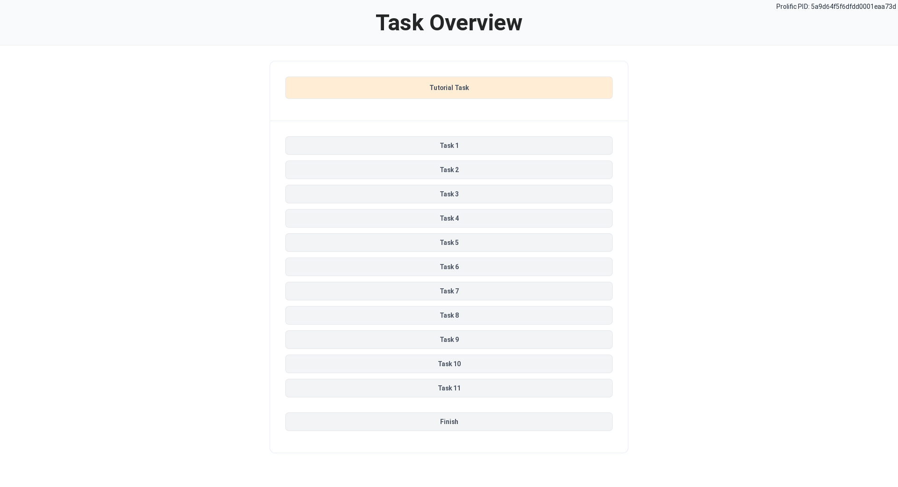
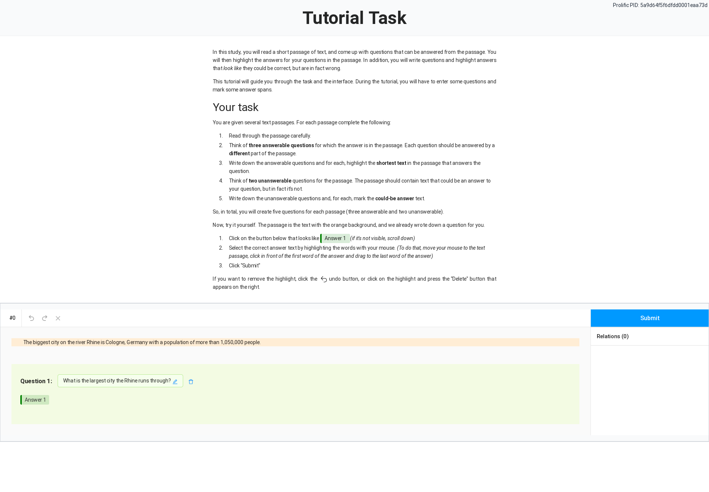
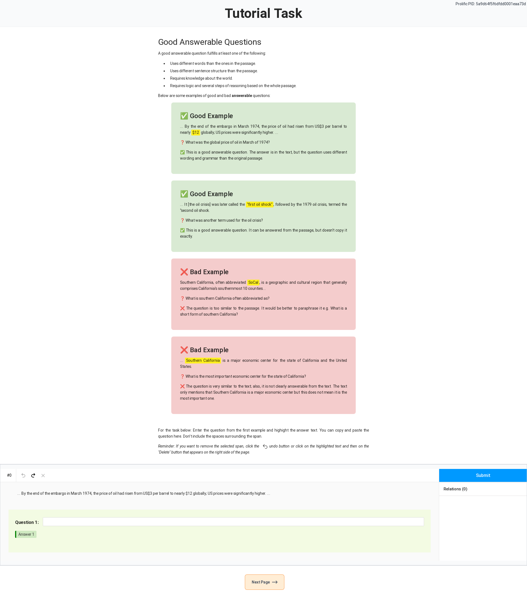
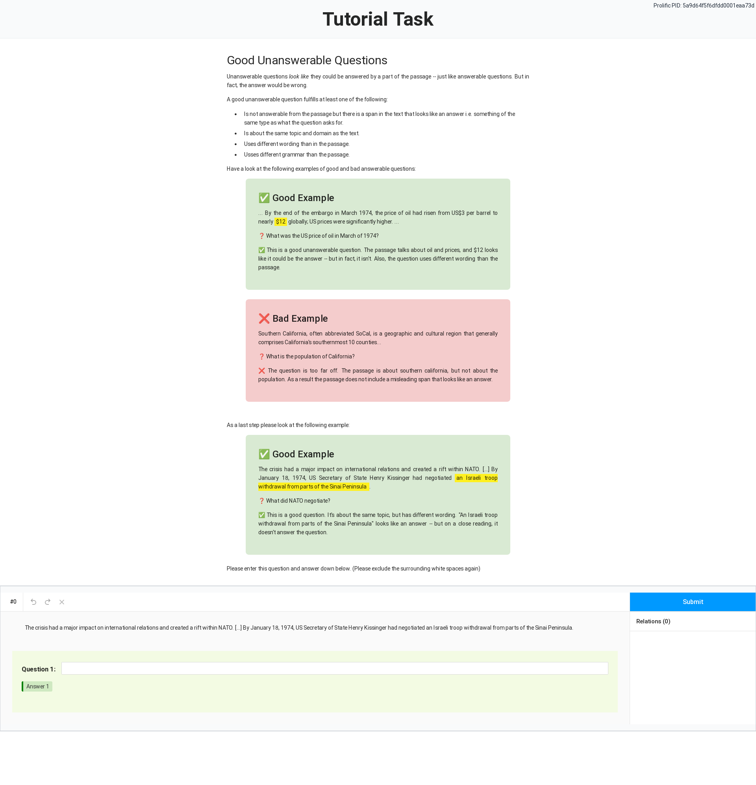

# M2QA Data Annotation Platform
## Tutorial
One crucial part of creating a high-quality benchmark dataset is a good tutorial. This tutorial introduces the crowdworkers to the task and teaches how to provide high-quality data. Below (in the "Screenshots From the Tutorial" part), you can find our tutorial, or you can have a look at the source code here: [app/templates/tutorial](app/templates/tutorial)

## Installation
1. Create conda environment: `conda env create --file environment.yaml`
2. Activate conda environment: `conda activate m2qa`
3. To install all dependencies for the frontend, follow the instructions from [app/README.md](app/README.md)
4. Create a system service under `/etc/systemd/system/mmqa-website.service` with this content: [mmqa-website.service](mmqa-website.service)
5. Install nginx and add this file [nginx-config-file.txt](nginx-config-file.txt) to `/etc/nginx/sites-enabled/mmqa`
6. The website is password protected. Generate admin and user passwords:
    - `sudo htpasswd -c /etc/nginx/admins.htpasswd <ADMIN_USERNAME>`
    - `sudo htpasswd -c /etc/nginx/.htpasswd <NORMAL_USER_USERNAME>`
7. If you want to use DeepL to translate the texts during your quality control, add your DeepL authentication key in plain text in `Website/app/deepl_auth_key.txt`

## Run the Annotation
### Import Data to Database
```
flask db import ../data/de/news/articles.json
```

### Add Prolific Study 
```
flask db add-study <study_id> <prolific_key>
```

For other commands, have a look here: [app/cli_db.py](app/cli_db.py) and [app/cli_statistics.py](app/cli_statistics.py)

### URL
- Needs PROLIFIC_PID, STUDY_ID, SESSION_ID and language: `<URL>?PROLIFIC_PID=<PROLIFIC_PID>&STUDY_ID=<STUDY_ID>&SESSION_ID=<SESSION_ID>&language=<LANGUAGE>`

## Screenshots From the Tutorial
Upon beginning an annotation session, the crowd-workers see this Overview page:


They then go through the tutorial, in which they have learned to use our interface and are introduced to the task.

### Tutorial Step 1


### Tutorial Step 2


### Tutorial Step 3

